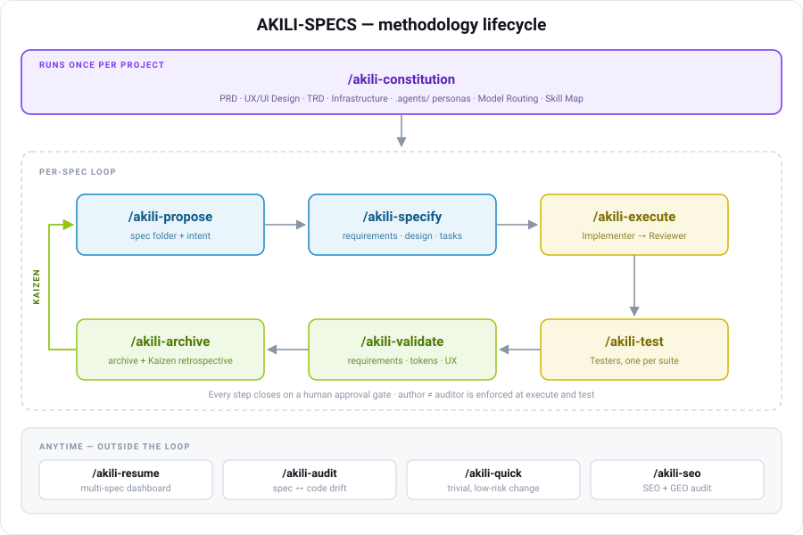

# AKILI Flow

AKILI keeps durable product, design, implementation, test, and validation context in repository files so agents do not have to infer the same project reality every session.

The workflow is inspired by OpenSpec's artifact-guided pattern, but AKILI adds a project constitution step, Claude/OpenCode skills, and explicit validation evidence before archive.



## Philosophy

```text
→ constitution before feature work
→ reviewable intent before implementation
→ behavior requirements before code
→ small verified tasks over broad rewrites
→ evidence before archive
```

## Day 1 on a Brand-New Project (from seed prompt to first spec)

The most common point of confusion: after the seed prompt drives `/akili-constitution` (PRD, UX/UI, TRD, infrastructure, `.agents/`), **what do you do with the seed prompt now?**

**Nothing — you never feed it to `/akili-propose`.** The PRD *is* the seed intent, structured and already approved through the constitution's own review gate. Re-proposing it would duplicate the PRD inside a `proposal.md`. The day-1 sequence is:

```text
1. Seed prompt → /akili-constitution        (Brand-new mode: PRD, design, TRD, infra, .agents/)
2. /akili-propose <first-milestone>          (Greenfield track: reads the PRD — no re-pasting —
                                              and decomposes the v1 scope into bounded changes
                                              with a RICE/MoSCoW build order, one proposal per chunk,
                                              each referencing PRD sections instead of restating them)
3. /akili-specify <first-chunk>              (requirements, design, tasks for the first slice)
4. /akili-execute → /akili-test → /akili-validate → /akili-archive
5. Repeat 3–4 per chunk, in the build order from step 2
```

If the whole v1 is genuinely one bounded piece, skip step 2 and go straight to `/akili-specify`. The proposal layer earns its cost when the MVP needs *chunking and ordering* — not as a re-statement ritual.

**Thin seed?** A one-line seed ("an app to sell cars") triggers the constitution's thin-seed protocol before any PRD is drafted: one bounded clarification round (≤7 batched questions, each with a proposed default the user can veto in a word), everything undecided lands as a **labeled Assumption** rather than invented prose, and the PRD comes out MVP-scoped with open questions instead of enterprise-shaped with fabricated certainty — downstream commands treat PRD statements as approved truth, so fabricated specificity would get *built*.

## Primary Lifecycle

```text
You: /akili-constitution
AI:  Creates or strengthens the project baseline:
     ✓ docs/prd.md
     ✓ docs/ux-ui/design.md
     ✓ docs/trd/trd.md
     ✓ docs/specs/general-setup/
     ✓ CLAUDE.md and AGENTS.md

You: /akili-propose add-remember-me
AI:  Creates docs/specs/changes/add-remember-me/proposal.md
     ✓ problem, scope, non-goals
     ✓ affected systems
     ✓ requirement delta preview
     ✓ approach options and recommendation

You: /akili-specify changes/add-remember-me
AI:  Creates or updates:
     ✓ requirements.md
     ✓ design.md
     ✓ tasks.md

You: /akili-execute changes/add-remember-me
AI:  Runs the Leader → Implementer → Reviewer harness on the next approved task
     ✓ Implementer writes code and runs verification
     ✓ Reviewer audits the diff and emits STATUS: PASS or STATUS: FAIL
     ✓ Up to 3 rework attempts on FAIL, then HALT for human guidance
     ✓ updates tasks.md
     ✓ appends execution.md with full PASS/FAIL audit trail
     ✓ commits with [SPEC:<spec-path>] and records verification evidence

You: /akili-test changes/add-remember-me
AI:  Creates test-report.md with requirement-to-test traceability (supports automated parsing via `scripts/parse_tests.js`)

You: /akili-validate changes/add-remember-me
AI:  Creates validation-report.md with PASS/WARN/FAIL/BLOCKED findings

You: /akili-archive changes/add-remember-me
AI:  Runs the Kaizen retrospective (appends docs/specs/kaizen-log.md), moves completed work into docs/specs/archive/, and refreshes CodeGraph

Independent Auditing:
You: /akili-audit
AI:  Scans codebase and detects drift against baselines, generating docs/specs/drift-report.md
```

## Fast-Track for Trivial Changes

Not every change needs the full lifecycle. For a genuinely trivial, low-risk change — a button color, a title's text, a small paragraph — use `/akili-quick`:

```text
You: /akili-quick login-button-color use the brand accent token on the primary login button
AI:  ✓ checks the triviality gate (cosmetic/copy-only, no behavior/data/API/auth change,
       ≤ ~20 LOC in one component, design-token safe)
     ✓ makes the edit directly
     ✓ runs a light verification (lint / type-check / existing test / manual note)
     ✓ appends a one-line entry to docs/specs/quick/quick-log.md
     ✓ commits with [SPEC:quick/login-button-color]
```

If the change fails the gate (it has logic, touches data/API/auth, needs a new design token, or is bigger than a tweak), `/akili-quick` stops and escalates to `/akili-specify` (Lite) or `/akili-propose`. This keeps spec-to-code traceability intact while sparing small changes the full flow.

## Handling Bugs

Bugs are **not** treated exactly like normal changes — a bug starts from a *symptom*, not an *intent*, so the root cause must be understood before a fix is proposed. AKILI does this without a separate command: `/akili-propose` classifies the request and, when it detects a bug, follows the **Bug Track**.

```text
You: /akili-propose checkout-total-wrong the cart total is off by one item after removing a product
AI:  ✓ classifies this as a Bug (records Type: Bug)
     ✓ loads systematic-debugging
     ✓ captures: observed symptom, reproduction steps, CONFIRMED root cause, impact/scope
     ✓ recommends a fix strategy and the route

You: /akili-specify bugfix/checkout-total-wrong
AI:  runs in Bug Mode — frames requirements around the corrected behavior and REQUIRES a
     regression test (red before the fix, green after) as a mandatory task
```

Routing by size:

- **Cosmetic bug** (e.g. a visible typo, wrong static label) → `/akili-quick`.
- **Bug with logic/behavior** → `/akili-propose` (diagnose) → `/akili-specify` Bug Mode (fix + regression test) → `/akili-execute` → `/akili-test` → `/akili-validate`.

The regression test is the non-negotiable evidence that the bug is actually fixed and stays fixed. `/akili-validate` then carries any unresolved `PRODUCT_BUG` from the test evidence through as a FAIL.

## Project Modes

`/akili-constitution` begins by classifying the repository into one of three modes. Each mode adjusts how aggressively the constitution drafts, scans, or preserves existing material — and how the project `.agents/` harness is scaffolded.

| Mode | Meaning | Constitution Behavior | `.agents/` Behavior |
|---|---|---|---|
| Brand-new (Seed Setup) | Little or no application code, no AKILI-SPECS docs, starting from scratch | Draft baseline from user intent, chosen stack, assumptions, and open questions | Copy default Leader / Implementer / Reviewer personas verbatim |
| Legacy (Discovery Setup) | Real code, package manifests, routes, tests exist; AKILI-SPECS baseline missing or skeletal | Inspect repository reality (CodeGraph preferred) before drafting; synthesize baseline from evidence | Copy defaults then customize with detected stack, design tokens, lint and test commands |
| Active AKILI-SPECS (Safe Update) | AKILI-SPECS baseline and possibly customized `.agents/` already in place | Upgrade weak sections, fill missing files, preserve custom rules | Never overwrite existing personas — append only the minimal upgrade blocks needed |

For Legacy and Active-AKILI-SPECS modes, CodeGraph is preferred when `.codegraph/` exists. If CodeGraph is missing but the CLI is available, the agent should ask before running `codegraph init -i`. If CodeGraph is unavailable or declined, normal file and content searches are used.

## Artifacts

| Artifact | Created By | Purpose |
|---|---|---|
| `docs/prd.md` | `/akili-constitution` | Product purpose, personas, goals, scope, success metrics |
| `docs/ux-ui/design.md` | `/akili-constitution` | UX system, flows, screen inventory, tokens, accessibility expectations |
| `docs/trd/trd.md` | `/akili-constitution` | Technical architecture, modules, data, APIs, integrations, testing strategy |
| `docs/specs/general-setup/` | `/akili-constitution` | Project-specific templates for future specs (includes the `family.md` manifest schema) |
| `docs/specs/<spec-path>/proposal.md` | `/akili-propose` | Reviewable intent, scope, options, and risks |
| `docs/specs/<spec-path>/requirements.md` | `/akili-specify` | Behavior contracts and scenarios |
| `docs/specs/<spec-path>/design.md` | `/akili-specify` | Implementation approach and trade-offs |
| `docs/specs/<spec-path>/tasks.md` | `/akili-specify` | Small executable tasks with verification |
| `docs/specs/<spec-path>/execution.md` | `/akili-execute` | Task execution history and evidence |
| `docs/specs/<spec-path>/test-report.md` | `/akili-test` | Requirement-to-test matrix and coverage gaps |
| `docs/specs/<spec-path>/validation-report.md` | `/akili-validate` | Final conformance audit |
| `docs/specs/drift-report.md` | `/akili-audit` | Conformance auditing of documentation vs. codebase reality |
| `docs/specs/kaizen-log.md` | `/akili-archive` | Accumulated metrics and root-cause lessons; the `## Active Lessons` digest is read by `/akili-propose`, `/akili-specify`, `/akili-execute`, and `/akili-resume` |
| `docs/specs/archive/.../archive-summary.md` | `/akili-archive` | Historical closure record |

## Review Gates

AKILI keeps humans in control at each important transition.

| Gate | Before Moving On, Confirm |
|---|---|
| Constitution | Baseline docs reflect the actual product and architecture |
| Proposal | Problem, scope, non-goals, and recommended approach are approved |
| Requirements | Observable behavior and scenarios are testable |
| Design | Technical approach fits the current repository |
| Tasks | Work is small enough to execute and verify incrementally |
| Execution | Each completed task has verification evidence |
| Testing | Key requirements have automated or accepted manual evidence |
| Validation | No unresolved FAIL findings remain |
| Archive | Warnings and follow-ups are accepted; Kaizen lessons are recorded and standardizations approved or deferred |

## Documentation Depth

Use the lightest documentation that still makes the work clear and verifiable.

| Depth | Use For | Capture |
|---|---|---|
| Quick (`/akili-quick`) | Genuinely trivial cosmetic/copy changes (button color, title text, small paragraph) | No spec docs — a one-line `quick-log.md` entry + `[SPEC:quick/<name>]` commit; escalates if not trivial |
| Lite | Small bugfixes, copy updates, narrow UI tweaks | Problem, scenario, focused task, verification command |
| Standard | Normal features and enhancements | Requirements, scenarios, design decisions, tasks, tests |
| Full | Risky, cross-cutting, API, data, auth, migration, or SEO work | Alternatives, rollout, risks, observability, rollback, explicit traceability |

Lite mode does not skip rigor. Requirements still need scenarios, tasks still need done criteria, and validation still needs evidence. `/akili-quick` is the only path that skips the spec documents — gated to genuinely trivial changes, and it auto-escalates anything larger to `/akili-specify` (Lite) or `/akili-propose`.

## Spec Folder Shape

```text
docs/specs/<spec-path>/
├── proposal.md
├── requirements.md
├── design.md
├── tasks.md
├── execution.md
├── test-report.md
├── validation-report.md
└── archive-summary.md
```

Common spec paths:

```text
docs/specs/changes/add-remember-me/
docs/specs/enhancements/renewals/
docs/specs/admin/user-management/
docs/specs/bugfix/login-redirect/
docs/specs/seo/example.com/
```

## Shortcut Paths

For a small, obvious change in a repository with a strong baseline, you may start at `/akili-specify <spec-path>`.

For unclear, risky, cross-functional, or stakeholder-sensitive work, start at `/akili-propose <change-name-or-spec-path>`.

For a new repository, stale documentation, or a major product pivot, start at `/akili-constitution`.

---

## Context Discipline (when to /compact, when to /clear)

AKILI's file-based design exists precisely so that **conversation context is disposable at phase boundaries**: everything durable — specs, `execution.md`, `tasks.md`, guides, the kaizen log — lives in the repository, and `/akili-resume` rebuilds a session from files alone. That inverts the usual economics: resetting context is nearly free *at a boundary* and expensive *mid-task*, so the discipline is about **where**, not whether.

The agent **cannot** run `/compact` or `/clear` — those are user commands in the host. What the methodology does instead is have commands **recommend the right action at the right moment** (context checkpoints), the same pattern as model checkpoints:

| Moment | Checkpoint says | Why it is safe |
|---|---|---|
| After `/akili-archive` | `/clear`, then fresh session for new work | The cleanest boundary in the methodology — the spec is closed and fully externalized |
| After `/akili-specify` approval | `/clear`, then `/akili-execute <spec-path>` fresh | Execution reloads everything from the spec files; nothing it needs lives only in chat |
| `/akili-execute` Step 5 (between tasks) | `/compact` (keep session) or park + `/clear` + `/akili-resume` | Task state is fully in `execution.md`/`tasks.md`; between tasks the conversation holds nothing irreplaceable |
| Mid-task, context critically low | Not a checkpoint — the Leader's **wind-down protocol** governs: finish or park `[~]` with full history, write the audit trail, stop | Mid-loop is exactly where resetting destroys working state |

Host specifics: Claude Code has `/compact` (trim, keep session) and `/clear` (full reset) plus automatic compaction as a safety net. Other hosts have their own equivalents — per the methodology's own rule, **name them only when confirmed for the user's installed version, never by guessing**.

---

## Multi-Spec Parallel Execution (fleet of sessions)

When one large proposal decomposes into several **independent** specs, they can be attacked in parallel — each spec in its own git worktree and branch, each running a **complete AKILI session** (its own Leader → Implementer → Reviewer loop), coordinated from a principal CLI. This is a different axis than the Leader's task fan-out: the unit of parallelism is a whole spec, and the coordinator is a **dispatcher of specs, not a Leader of tasks**.

```text
Principal CLI (coordinator/dispatcher)
├── worktree spec-a  (branch: spec/a) → full AKILI session: /akili-execute a
├── worktree spec-b  (branch: spec/b) → full AKILI session: /akili-execute b
└── worktree spec-c  (branch: spec/c) → full AKILI session: /akili-execute c
     … then serial merges back, in dependency order
```

**Preconditions — all four, or the pattern does not apply:**

1. **Spec-level independence, decided at decomposition time, persisted in `family.md`, not at dispatch time.** When the specs originate from a chunked proposal, their `Parallel-safe` and `Depends on` columns in the parent `family.md` manifest (schema: `/akili-constitution` Step 7 general-setup templates) are the source for this precondition — the coordinator reads them, it does not re-derive independence. The underlying test is still the two-part one: disjoint files AND no shared build output/ports/dependency coupling *between the changes*. Specs that touch a shared contract go serial, in dependency order; specs with no manifest (flat specs) still need this judgment made explicitly before dispatch.
2. **`Approval Mode: pre-approved`** recorded in each spec's Document Control. A background session with interactive gates waits forever for a human who is not watching that terminal. Exceptions (HALT, Pivot, budget tripwire, `FATAL_FAIL`) still stop — see the escalation rule below.
   **Per-host launch:** in Claude Code, start each child with `claude -p "/goal <condition>"`, using the canonical condition from the Unattended Mode block in `/akili-execute` Step 5 rather than a rewritten one — the loop runs to completion in that single invocation ([docs](https://code.claude.com/docs/en/goal.md)). In Google Antigravity, put the spec-completion goal and the same exception contract in the dispatch brief: the agent pursues the mission autonomously and produces artifacts, and completion is verified by you from those artifacts — the platform evaluates no completion condition ([source](https://antigravity.google/blog/introducing-google-antigravity)). For OpenCode there is no verified equivalent, so this guidance makes no claim.
3. **Worktree cost amortized.** Each worktree pays a fresh install/build. A 2-task spec does not earn one; a 10-task spec does.
4. **A dispatch mechanism with the delivery chain honored** — Orca orchestration when the project's Skill Map lists it (preferred: structured messages, worker_done waits), or terminal-driven sessions (tmux, agent CLIs) as the low-level transport. Same rules either way.

**The coordinator's contract (dispatcher, not Leader):**

| The coordinator does | The coordinator does NOT |
|---|---|
| Verify each target session is live, dispatch each spec with its return path declared (supervised vs handoff, said out loud) | Adjudicate Reviewer FAILs inside a child session — that is the child Leader's job |
| Enforce the delivery chain per child: send verified at the target (`terminal show`-equivalent), **idle ≠ delivered** (poke once on idle-without-report) | Read child `execution.md` files cover to cover — it consumes each child's bounded completion report |
| Receive per-spec completion reports (bounded summaries: final status, tasks done, verification evidence pointer, branch name) | Re-derive or re-verify the child's work — commit to the delegation |
| Escalate child exceptions (HALT / Pivot / tripwire) to the user — exceptions always reach a human, `pre-approved` never absorbs them | Absorb a HALT silently or "fix" a child's blocker itself |
| Order and execute the **serial merge phase** in dependency order, with an integration verification after each merge | Merge in parallel, or merge a branch whose spec did not reach a PASS/validated state |

**Width and waves at spec scale:** the same landing physics binds. Implementation parallelizes; **integration does not** — N branches means N serial merges plus integration verification, and each child's completion lands in the coordinator's one context. Default **2 concurrent spec sessions, at most 3**; a proposal that chunks into six specs runs as waves (2–3, merge, next wave), never as a six-wide fleet. Wave composition and merge order follow the `family.md` manifest's `#` (build order) and `Depends on` columns, not folder-discovery order. Merges happen between waves, so each wave starts from a master that already contains the previous wave — which also catches cross-spec drift early, while it is one merge old instead of six.

**Recovery is per-worktree and already solved:** a dead or interrupted child session is resumed in place with `/akili-resume` in its worktree — its `execution.md` is the handoff, exactly as in single-session work. The coordinator's own state is small by design (dispatch log + reports received), so it should be trivially reconstructible; keep it in a file, not in conversation.

---

## Advanced Engineering Capabilities

To support robust, long-term development cycles, AKILI includes the following specialized workflows:

### 1. Spec-to-Code Traceability (Git & Comments)
To establish high-traceability between spec files and source code:
* **Commit Messages:** Every commit made during `/akili-execute` must be prefixed with `[SPEC:<spec-path>]` (e.g. `git commit -m "[SPEC:changes/add-remember-me] implement secure cookie storage"`).
* **Comment Tracing:** For complex algorithms, API entry points, or core models, developers/agents should place a reference comment: `// @akili-spec <spec-path>`.

### 2. Specification Drift Auditing (`/akili-audit`)
Run `/akili-audit` independently to verify that the active codebase reflects active documentation. The command produces `docs/specs/drift-report.md` detailing:
* **Stale Specifications:** Documented endpoints/modules missing from code.
* **Undocumented Code:** Active code additions completely missing from the PRD, UX/UI design, or TRD docs.
* **Styling/Architecture Violations:** Active code violating styling tokens or engineering guidelines.
* **Agent Guide Drift:** Modules lacking a needed child `CLAUDE.md`/`AGENTS.md`, child guides missing from the parent's `## Module Guides` index, or root-guide structure descriptions that no longer match the codebase.

### 3. The Pivot Protocol
If discovery during `/akili-execute` invalidates requirements or design rules:
1. Mark the current task in `tasks.md` as `[~]` (blocked).
2. Append a `## Pivot Record: <Task ID>` under `execution.md` explaining the conflict, technical constraints, and proposed options.
3. Update `requirements.md`, `design.md`, and/or `tasks.md` in the spec folder.
4. Obtain user sign-off on the pivot before resuming execution.

### 4. CodeGraph Refresh Trigger
When compiling the `archive-summary.md` and moving folders to the archive via `/akili-archive`:
* The agent detects if `.codegraph/` configuration folders are present.
* The agent reminds or executes the re-indexing command (e.g., `codegraph index`) to guarantee semantic search utilities remain highly functional for subsequent sessions.

### 5. Automated Test Reporting (`scripts/parse_tests.js`)
Rather than manually compiling assertion results during `/akili-test`:
1. Execute tests outputting to JSON (e.g. `jest --json --outputFile=jest-results.json` or `vitest --reporter=json`).
2. Run `node <path-to-akili>/scripts/parse_tests.js jest-results.json` to generate the AKILI matrix table automatically for inclusion inside `test-report.md`.

### 6. Multi-Agent Harness (`/akili-execute` Triad and `/akili-test` Testers)

`/akili-execute` is implemented as a multi-agent orchestration rather than a single-agent script. The Leader role does not write production code; it delegates implementation and audit to two subordinate roles, then enforces a strict PASS/FAIL gate before the task advances.

**Roles** — all three live in the project's `.agents/` directory, scaffolded by `/akili-constitution`:

| Role | File | Responsibilities |
|---|---|---|
| Leader | `.agents/leader.md` | Picks the next eligible task, delegates work, enforces the rework loop, updates `tasks.md` and `execution.md`, commits with `[SPEC:<spec-path>]` |
| Implementer | `.agents/implementer.md` | Writes code strictly within task scope, applies design tokens from `docs/ux-ui/design.md`, runs the verification command before reporting |
| Reviewer | `.agents/reviewer.md` | Read-only diff audit against requirements, design tokens, and the TRD; outputs a structured PASS or FAIL with *Discovered Issue*, *Violated Rule*, and *Remediation Suggestion* |

**Loop:**

```text
Leader picks the next task → spawns Implementer with task + persona
Implementer writes code, runs verification → reports back
Leader extracts git diff → spawns Reviewer with diff + persona
Reviewer returns STATUS: PASS, STATUS: FAIL, or STATUS: FATAL_FAIL

if PASS → append execution.md, then update tasks.md, commit, advance
if FAIL and attempts < 3 → respawn Implementer with the Reviewer's structured findings
if FATAL_FAIL → abort loop immediately, mark task [~], trigger Pivot Protocol
if 3 consecutive FAILs → HALT, mark task [~], present audit trail
```

**Why this exists:**

- **Eliminates confirmation bias.** The same agent that writes code does not also approve it.
- **Keeps each context tight.** Each role sees only the slice of spec it needs.
- **Hard PASS/FAIL gate.** Design tokens, requirements conformance, and stability are enforced before the task is marked `[x]`.

**Guardrails & Token Optimization:**

- **Maximum retries.** A hard ceiling of 3 rework attempts per task.
- **Fail-Fast (FATAL_FAIL).** Reviewer aborts the loop on critical architectural violations to save tokens.
- **Diff-Only Review.** The Reviewer reads only the git diff to drastically reduce context window size.
- **Structured feedback.** The Reviewer's FAIL report is forwarded unchanged to the next Implementer spawn.
- **Pivot Protocol takes precedence.** If discovery proves the spec itself is wrong, the loop stops immediately; rework retries are not consumed on a broken spec.

**Cross-tool compatibility:**

The `.agents/` directory is pure Markdown + YAML frontmatter and is resolved relative to the active workspace, so the harness runs under Claude Code, OpenCode, and Google Antigravity. Claude Code and OpenCode delegate through the Step 8E wrappers when present — each wrapper loads its own `.agents/<role>.md`, so the Leader neither re-reads nor re-sends persona content — and fall back to sub-prompt contexts seeded with the persona files when no wrappers exist. **Antigravity resolves agents one level deeper** — it discovers them under `.agents/agents/` and invokes them with `invoke_subagent`, which also requires `subagent: true` in the wrapper's frontmatter, so a persona left at the root of `.agents/` is invisible to it. [Step 8E](commands/akili-constitution.md) generates the nested wrappers, which stay thin and point back at the same persona files.

**`/akili-test` — Leader → Tester(s):**

`/akili-test` uses the same Leader pattern with a fourth persona, `.agents/tester.md`, and a token-aware **Deployment Rule**. The Leader partitions testing into suites (backend unit, frontend unit, integration, E2E) and decides how many Testers to spawn:

| Situation | Action |
|---|---|
| Lite depth or a single trivial suite | Run **inline** — no spawn (cheaper than delegating) |
| Standard/Full with one substantial suite | One Tester |
| Multiple **independent** suites | One Tester per suite, **in parallel** |
| Suites sharing files/fixtures | Testers run sequentially |

Each Tester gets only its suite's requirements, scenarios, and test command (never the full spec set), runs a bounded 3-attempt self-correction inner loop, and returns `STATUS: PASS`, `STATUS: FAIL`, or `STATUS: PRODUCT_BUG` — keeping a correct test red on a genuine product defect instead of rewriting it to pass. The Leader aggregates the per-suite coverage slices into the `test-report.md` requirement-to-test matrix. Ideally a Tester runs on a different model than the Implementer that wrote the code (author ≠ tester).

### 7. Capability-Tier Model Routing

Each AKILI-SPECS phase has a different dominant demand, so AKILI routes phases to models by **capability
tier** rather than using one model everywhere. Six tiers — **T1 Architect, T2 Coder, T3 Auditor,
T4 Context-Ingest, T5 Fast-Cheap, T6 Multimodal** — map to the phases:

| Phase / Role | Tier |
|---|---|
| `/akili-constitution` | T4 + T1 |
| `/akili-propose`, `/akili-specify` (requirements/design/tasks) | T1 |
| `/akili-quick` | T2 |
| `/akili-specify` (UX/UI design) | T6 |
| `/akili-execute` Leader / Implementer / Reviewer | T1 / T2 / T3 |
| `/akili-test` Leader / Tester(s) | T1 / T2 |
| `/akili-validate` | T3 |
| `/akili-audit` | T4 + T3 |
| `/akili-archive` | T5 |

A single editable registry binds each tier to a model **per tool** (Claude Code, OpenCode, and Antigravity),
using **floating aliases** (`opus`/`sonnet`/`haiku`) wherever they exist so the registry survives
model generations without edits. `/akili-constitution` (Step 8C) scaffolds a `## Model Routing`
copy into the project's `AGENTS.md` / `CLAUDE.md`.

Routing operates at two levels:

* **Enforced (subagents):** `/akili-constitution` Step 8E can generate tool-native agent wrappers
  (`.claude/agents/akili-{leader,implementer,reviewer,tester}.md` in Claude Code, agent config in
  OpenCode) that pin each persona to its tier's model. `/akili-execute` and `/akili-test` prefer
  those named agents — so **author ≠ auditor** (Reviewer model ≠ Implementer model) holds by
  configuration on the fan-out where most tokens are spent.
* **Guided (main loop):** every command emits a one-line, never-blocking **model checkpoint** in
  its setup step when the phase's tier maps to a different model than the current session.

No `model:` frontmatter on commands and no installer changes. `/akili-audit` reports **Model
Registry Drift** (stale model names, dated pins where an alias exists, wrappers contradicting the
registry). See [model-routing.md](model-routing.md) for the tiers, principles, and the default
registry.

### 8. The Kaizen Loop

AKILI embeds Kaizen — continuous improvement through small, disciplined steps — as an executable
retrospective inside `/akili-archive`, powered by the packaged `kaizen` skill (authored by
Juan Carlos Cadavid — jcadavid.com). Every archive runs one bounded pass:

* **Measure:** hunt waste (MUDA) in the spec's own evidence — Reviewer rework attempts, pivots,
  PRODUCT_BUGs, severe judgment-day findings, validation WARN/FAIL, drift.
* **Learn:** distill 0–3 lessons, each with a named root cause and cited evidence. Generic lessons
  are banned; a clean spec records a one-line clean-run entry instead.
* **Standardize:** propose 1–3 line edits to constitution guides, `general-setup` templates, design
  tokens, or `.agents/` personas. **Every edit outside the kaizen log requires human approval.**
* **Record:** append to the accumulative `docs/specs/kaizen-log.md`. Its capped `## Active Lessons`
  digest (10 rows max) is the only part other commands read.

Lessons target either the **Product** (this project) or the **Methodology** itself — Methodology
lessons are flagged for upstreaming to the AKILI repository, so the methodology learns from every
tool built with it. The retrospective never blocks the archive.

### 9. Skill Binding (Governance)

The packaged skills are curated under a three-level binding taxonomy (see `docs/skills/governance.md`),
which answers *when and how each skill loads*:

* **core** — hard-wired to a precise command step: `kaizen` in `/akili-archive`, `judgment-day` in
  `/akili-specify`'s Review Design gate, `cognitive-doc-design` for every human-facing document,
  `brainstorming` for exploration, `product-manager-toolkit` in `/akili-constitution`,
  `systematic-debugging` in bug flows, `seo-audit` in `/akili-seo`.
* **conditional** — loaded when the work touches its domain: `ui-ux-pro-max` / `frontend-design` /
  `stitch-design` for UI work, `gsap-animation` for animation work.
* **stack** — framework/platform skills (`angular-developer`, `nestjs-expert`, `shadcn-ui`,
  `aws-serverless`, …) are never hardcoded into commands. `/akili-constitution` Step 8D writes a
  `## Skill Map` into the project's `AGENTS.md`/`CLAUDE.md` from the detected stack;
  `/akili-specify` derives each task's required skills from that map; the Leader passes them to the
  Implementer/Tester via dynamic skill loading.

Every skill preserves its original author and license; AKILI adaptation is recorded as `adapted-by`
in the skill frontmatter. Curation by Juan Carlos Cadavid — jcadavid.com.
